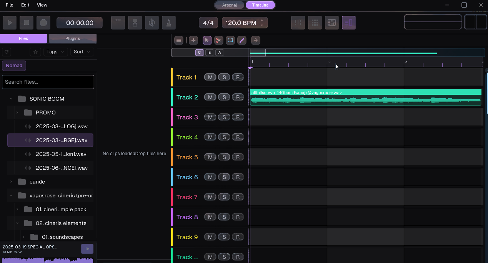

# 🧭 AESTRA


> **A modern, professional digital audio workstation built from the ground up with intention.**
> Featuring ultra-low latency audio, GPU-accelerated UI, and a pattern-based workflow.



---

## 🌍 What is Aestra?

**Aestra** is a next-generation digital audio workstation designed for musicians who demand professional quality without compromise. Built with modern C++17, Aestra delivers a clean, responsive experience with cutting-edge audio technology and a workflow that makes sense.

Aestra combines:

- **Ultra-low latency audio engine** powered by a dual-tier ASIO/WASAPI system
- **Custom GPU-accelerated UI framework** (AestraUI) for buttery-smooth 60 FPS performance
- **Modern pattern-based timeline** with intuitive pattern and playlist sequencing
- **Professional-grade 64-bit audio processing** with multi-threaded architecture
- **Source-available transparency** — see exactly how your DAW works under the hood

Whether you're producing electronic music, scoring films, or recording live instruments, Aestra provides the tools and performance you need to create without limits.

---

## ⚙️ Core Features

### 🎵 Audio Engine

- **ASIO Driver Support** — Professional, super-low latency audio with native COM integration
- **WASAPI Integration** — Seamless fallback for consumer audio hardware
- **Multi-threaded Processing** — 64-bit audio pipeline for maximum performance
- **Sample-accurate Timing** — Professional-grade playback precision
- **Low-latency Design** — Optimized for real-time audio with <10ms latency
- **RtAudio Backend** — Cross-platform audio abstraction layer

### 🎨 User Interface

- **AestraUI Framework** — Custom OpenGL 3.3+ renderer with MSAA anti-aliasing
- **Adaptive FPS System** — Intelligent rendering optimization (24-60 FPS)
- **Advanced Timeline** — Familiar workflow with adaptive grid and waveform visualization
- **Theme System** — Dark/light modes with customizable color schemes
- **SVG Icon System** — Crisp, scalable vector icons with dynamic color tinting
- **Smooth Animations** — Hardware-accelerated transitions and effects

### 🛠️ Development

- **Modern C++17** — Clean, maintainable codebase
- **CMake Build System** — Cross-platform build configuration
- **Modular Architecture** — Clear separation: Core, Platform, Audio, UI
- **Git Hooks** — Pre-commit validation for code quality
- **CI/CD Pipeline** — Automated testing and validation
- **clang-format** — Consistent code style across the project

---

## 🎧 Supported Platforms & Requirements

### Windows 10/11 (Primary Platform)

**Minimum Requirements:**

- OS: Windows 10 64-bit (build 1809+) or Windows 11
- CPU: Intel Core i5 (4th gen) or AMD Ryzen 3
- RAM: 8 GB
- GPU: DirectX 11 compatible with 1 GB VRAM
- Audio: WASAPI-compatible audio interface

**Recommended:**

- CPU: Intel Core i7/i9 or AMD Ryzen 7/9
- RAM: 16 GB or more
- GPU: Dedicated graphics card with 2+ GB VRAM
- Audio: Low-latency audio interface (ASIO recommended for best performance)
- Storage: SSD for project files and sample libraries

### Future Platform Support

- **Linux** — X11/Wayland support planned
- **macOS** — Cocoa integration planned

---

## 🧭 Philosophy & Vision — Aestra's "True North"

At Aestra Studios, we believe software should feel like art — light, native, and human.

**Our Core Values:**

- 🆓 **Transparency First** — Source-available code you can trust and learn from
- 🎯 **Intention Over Features** — Every feature serves a purpose, no bloat
- ⚡ **Performance Matters** — Professional-grade audio with ultra-low latency
- 🎨 **Beauty in Simplicity** — Clean UI that gets out of your way
- 🤝 **Community-Driven** — Built by musicians, for musicians

**Why Aestra is Different:**

- Source code is publicly visible for educational transparency
- Modern architecture designed for the future, not legacy constraints
- GPU-accelerated UI that rivals native applications
- Professional audio quality without the learning curve of complex DAWs

We're building the DAW we wish existed — powerful yet approachable, professional yet personal.

---

## 🛠️ How to Build

### Quick Start (Windows)

1. **Install Prerequisites:**
   - CMake 3.15+
   - Git
   - Visual Studio 2022 with C++ workload
   - PowerShell 7

2. **Clone and Build:**

   ```powershell
   git clone https://github.com/currentsuspect/Aestra.git
   cd Aestra
   
   # Install Git hooks for code quality
   pwsh -File scripts/install-hooks.ps1
   
   # Configure build
   cmake -S . -B build -DAestra_CORE_MODE=ON -DCMAKE_BUILD_TYPE=Release
   
   # Build project
   cmake --build build --config Release --parallel
   ```

3. **Run Aestra:**

   ```powershell
   cd build/bin/Release
   ./Aestra.exe
   ```

### Detailed Build Instructions

For comprehensive build instructions including troubleshooting, see **[Building Guide →](docs/getting-started/building.md)**

---

## 📚 Documentation

**[📘 Visit the Complete Documentation Site →](https://currentsuspect.github.io/Aestra/)**

Explore our beautiful, searchable documentation built with MkDocs Material:

- **🚀 [Getting Started](docs/getting-started/index.md)** — Setup guides and quickstart tutorials
- **🏗️ [Architecture](docs/architecture/overview.md)** — System design with interactive diagrams
- **👨‍💻 [Developer Guide](docs/developer/contributing.md)** — Contributing, coding standards, debugging
- **📖 [Technical Reference](docs/technical/faq.md)** — FAQ, glossary, roadmap
- **🔌 [API Reference](docs/api/index.md)** — Complete API documentation
- **🤝 [Community](docs/community/code-of-conduct.md)** — Code of conduct, support, security

### Quick Links

- [Building Aestra](docs/getting-started/building.md) — Detailed build instructions
- [Contributing Guide](docs/developer/contributing.md) — How to contribute
- [Architecture Overview](docs/architecture/overview.md) — Understanding Aestra's design

### 📚 API Documentation Generation

Generate comprehensive API documentation locally using Doxygen:

**Quick Start:**

```bash
# Windows
.\scripts\generate-api-docs.bat

# Or with PowerShell
.\scripts\generate-api-docs.ps1 generate -Open

# macOS/Linux
doxygen Doxyfile
```

**Features:**

- 📖 Complete API reference for all modules
- 🔗 Cross-referenced code with call graphs
- 📊 Class diagrams and inheritance trees
- 🔍 Full-text search functionality
- 💻 Source code browser

See **[API Documentation Guide →](docs/API_DOCUMENTATION_GUIDE.md)** for detailed instructions.

---

## 🤝 How to Contribute

We welcome contributions from the community! Whether you're fixing bugs, adding features, or improving documentation, your help makes Aestra better.

### Quick Contribution Guide

1. **Fork and Clone** — Fork this repo and clone it locally
2. **Create a Branch** — Work on a feature or fix in a separate branch
3. **Follow Code Style** — Use clang-format and follow our [Coding Style Guide](docs/developer/coding-style.md)
4. **Test Your Changes** — Ensure builds pass and functionality works
5. **Submit a PR** — Open a pull request with a clear description

### Contributor License Agreement

By contributing to Aestra, you agree that:

- All contributed code becomes property of Dylan Makori / Aestra Studios
- You grant Aestra Studios full rights to use, modify, and distribute your contributions
- You waive ownership claims to your contributions
- Contributions are made under the ASSAL v1.0 license terms

For detailed contribution guidelines, see **[Contributing Guide →](docs/CONTRIBUTING.md)**

### Ways to Contribute

- 🐛 **Report Bugs** — Help us identify and fix issues
- 💡 **Suggest Features** — Share ideas in GitHub Discussions
- 📝 **Improve Documentation** — Help others understand Aestra
- 🔧 **Submit Code** — Fix bugs or implement features
- 🧪 **Test & Review** — Test builds and review pull requests

---

## 🧾 License — ASSAL v1.1

**Aestra** is licensed under the **Aestra Studios Source-Available License (ASSAL) v1.1**.

### License Summary

**You MAY:**

- ✅ View and study the source code for educational purposes
- ✅ Report bugs and security vulnerabilities
- ✅ Suggest features and improvements
- ✅ Submit pull requests (contributors grant all rights to Aestra Studios)

**You MAY NOT:**

- ❌ Use the software or code without written consent
- ❌ Create derivative works or competing products
- ❌ Redistribute or sublicense the code
- ❌ Remove or alter proprietary notices

### SPDX Identifier

```SPDX

SPDX-License-Identifier: ASSAL-1.1
```

All source files include the following header:

```cpp
// © 2026 Aestra Studios – All Rights Reserved. Licensed for personal & educational use only.
```

### Full License Text

- **[View LICENSE →](LICENSE)** — Full legal license text
- **[License Reference →](docs/LICENSE_REFERENCE.md)** — Detailed breakdown and FAQ

**Important:** The source code is publicly visible for transparency, but is **NOT open-source**. All rights reserved by Dylan Makori / Aestra Studios.

---

## 🧠 About Aestra Studios

**Aestra Studios** was founded by **Dylan Makori** in Kenya with a simple mission: make professional music tools accessible to everyone, without compromise.

### Our Story

Frustrated with bloated DAWs that prioritized features over performance, Dylan set out to build a modern audio workstation from scratch. Aestra is the result of that vision — a DAW that respects your time, your creativity, and your hardware.

Every line of code in Aestra is written with intention. No shortcuts, no legacy cruft, just clean, modern C++ designed for the future of music production.

### Brand Values

- 🌍 **Global Accessibility** — Built in Kenya, for the world
- 🎓 **Education First** — Source-available code for learning
- ⚡ **Performance Obsessed** — Every millisecond matters
- 🎨 **Design Matters** — Beautiful software inspires beautiful music
- 🤝 **Community Powered** — Built with feedback from real musicians

### Contact & Support

**Dylan Makori** — Founder & Lead Developer  
📧 Email: [makoridylan@gmail.com](mailto:makoridylan@gmail.com)  
🐙 GitHub: [@currentsuspect](https://github.com/currentsuspect)  
🌐 Website: Coming Soon

**Support Channels:**

- 🐛 [Report Issues](https://github.com/currentsuspect/Aestra/issues) — Bug reports and feature requests
- 💬 [GitHub Discussions](https://github.com/currentsuspect/Aestra/discussions) — Community forum
- 📧 Direct Email — For partnerships and licensing inquiries

---

## 🙏 Acknowledgments

Aestra wouldn't be possible without these incredible open-source projects:

- **RtAudio** — Cross-platform audio I/O
- **nanovg** — Hardware-accelerated vector graphics
- **stb_image** — Image loading utilities
- **Aestra Profiler** — Performance profiling
- **CMake** — Build system

Thank you to all contributors and the open-source community for making Aestra possible.

---

## 🗺️ Roadmap — v1 Beta (December 2026)

**Target:** Ship a credible, stable v1 Beta focused on **pattern-based Hip-Hop production**.

### ✅ Completed (Jan 2026)

- Core audio engine (WASAPI/ASIO dual-tier)
- AestraUI framework with OpenGL rendering
- Pattern-based timeline/playlist
- Drag-and-drop, clip editing, trimming
- Mixing (volume, pan, mute, solo)
- Project save/load
- VST3/CLAP plugin scanner

### 🎯 Phase 1 — Foundation Lock (COMPLETE) (Jan–Mar 2026)

✅ App structure refactor (reduce Main.cpp complexity)
✅ Project loop reliability (open → edit → save → reopen)
✅ Data model API freeze

### 🎯 Phase 2 — Project + Undo/Redo (Apr–Jun 2026)

✅ Project format v1 spec with versioning
✅ Undo/redo for core actions
-[ ] Autosave + crash recovery

### 🎯 Phase 3 — Recording + Export (Jul–Sep 2026)

- Recording workflow reliability
- Offline render/export
- Device stress testing

### 🎯 Phase 4 — Plugin Decision Gate (Sep 2026)

- Option A: Ship with internal Arsenal only
- Option B: Minimal VST3/CLAP MVP (if stable)

### 🎯 Phase 5–6 — Hardening + Release (Oct–Dec 2026)

- Bug triage, performance budgets
- Signed Windows installer
- v1 Beta ship

See **[docs/technical/roadmap.md](docs/technical/roadmap.md)** for the full execution plan.

---

## 📜 Repository Structure

Aestra/
├── docs/               # Comprehensive documentation portal
├── AestraCore/          # Core utilities (math, threading, file I/O, logging)
├── AestraPlat/          # Platform abstraction (Win32, X11, Cocoa)
├── AestraUI/            # Custom OpenGL UI framework
├── AestraAudio/         # Audio engine (WASAPI, RtAudio, mixing)
├── Source/             # Main DAW application
├── AestraAssets/        # Icons, fonts, themes
├── scripts/            # Build and utility scripts
├── meta/               # Project metadata, changelogs, summaries
│   ├── CHANGELOGS/     # Historical changelogs
│   └── BUG_REPORTS/    # Bug fix documentation
├── cmake/              # CMake modules
└── LICENSE             # ASSAL v1.1 license

- **Gitleaks Scanning** — Automated secret detection on all commits
- **Pre-commit Hooks** — Prevents accidental secret commits
- **Security Audits** — Regular code reviews for vulnerabilities
- **Responsible Disclosure** — Report security issues privately via email

For security concerns, contact: [makoridylan@gmail.com](mailto:makoridylan@gmail.com)

See **[SECURITY.md](SECURITY.md)** for our full security policy.

---

## 💬 Community

Join the conversation:

- **Discord** — [Invite Link](https://discord.gg/aestra-studios)
- **GitHub Discussions** — [Open Discussions](https://github.com/currentsuspect/Aestra/discussions)
- **Twitter/X** — [@AestraStudios](https://twitter.com/AestraStudios)

---

## 📜 License

Aestra is distributed under the **Aestra Studios Software Agreement License (ASSAL) v1.1**. See **[LICENSE](LICENSE)** for full terms.

**Key Terms:**

- **Non-commercial use only** (for now)
- **No redistribution** without permission
- **No reverse engineering** of proprietary components

For commercial licensing inquiries, contact: [makoridylan@gmail.com](mailto:makoridylan@gmail.com)

---

## 🎵 Support Aestra

If you enjoy using Aestra, consider supporting its development:

- **GitHub Sponsors** — [Sponsor Aestra](https://github.com/sponsors/currentsuspect)
- **Ko-fi** — [Buy Me a Coffee](https://ko-fi.com/aestrastudios)
- **Patreon** — [Become a Patron](https://www.patreon.com/aestrastudios)

---

**Built by musicians, for musicians. Crafted with intention.** 🎵

⭐ **Star this repo** if you believe in transparent, professional audio software!

*Copyright © 2026 Dylan Makori / Aestra Studios. All rights reserved.*  
*Licensed under ASSAL v1.1*
