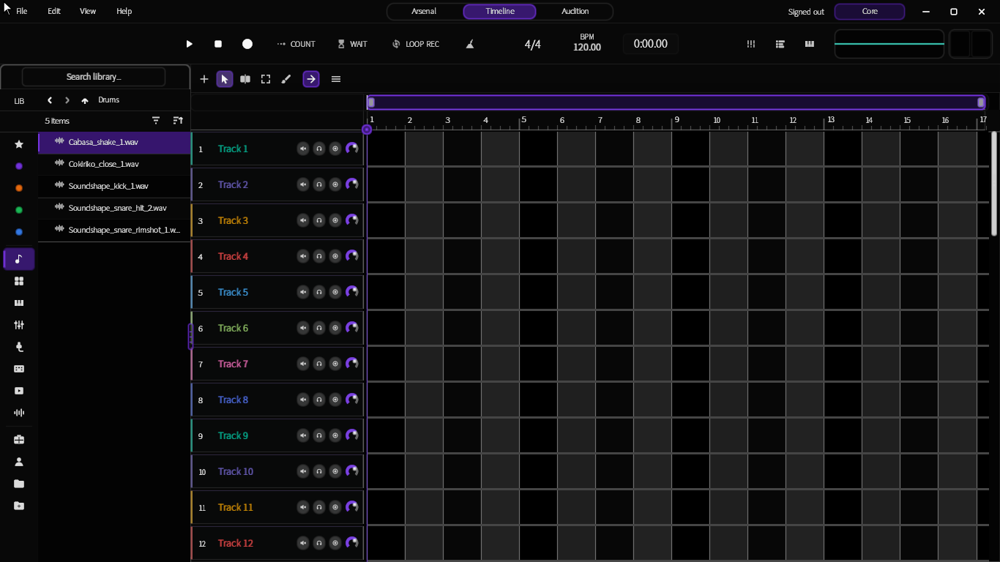

# Aestra


> A digital audio workstation under active development, built in modern C++ with a custom UI stack and a native audio engine.



## Current Snapshot

Aestra is on a public `0.x` pre-beta line. The roadmap target is **v1 Beta in December 2026**.

As of the v0.7.0-alpha milestone (August 2026) the repo is in active engineering
mode rather than release-polish mode. Paths that are covered by tests and verified
end to end:

- Built-in plugin discovery through the normal manager/factory path
- `Aestra Rumble` instantiation, state save/restore, and project round-trips
- Arsenal units holding real plugin instances rather than placeholders, driven by a step sequencer
- Headless Arsenal playback routing MIDI into Rumble and producing audible output
- Offline render of a pattern or an arranged timeline to WAV
- Out-of-process plugin hosting on POSIX, including CLAP note-port dialect negotiation
- Hardware MIDI input, and automation that reaches the audio path
- Routing and gain staging: a signal routed through any mixer channel keeps its level,
  and live playback, offline export, isolated bounce, audition preview, and input
  monitoring share one gain law
- The Master channel as a plugin host, with insert chains processed on the master bus
  and their latency fed into the plugin-delay-compensation graph
- Automation lanes: automatable end to end, with edits reaching the audio path
- The isolation contract: solo governs the live mix, and isolated-track bounce renders
  only the selected track's stage
- Project and plugin persistence coverage in the confidence suite

Aestra also exposes a **scriptable control surface** — see [Muse](#muse-the-control-surface) below.

> **A note on documentation currency.** The narrative documents below lag the code by
> some margin: the roadmap describes repo state as of January 2026. `CHANGELOG.md` is
> current through the v0.7.0-alpha milestone, and where a document and the code
> disagree, `git log` and the test suite are the honest sources — this section is
> written from them rather than from the documents.

- [docs/technical/testing_ci.md](docs/technical/testing_ci.md) — CI posture and test lanes
- [docs/technical/roadmap.md](docs/technical/roadmap.md) — direction and scope (dated March 2026)
- [meta/CHANGELOGS/](meta/CHANGELOGS/) — quarterly changelogs

## Muse: the control surface

Aestra can be driven from a terminal or by an agent, over the same command system the UI
uses — so scripted edits land in the same undo history as hand edits.

```bash
AESTRA_MUSE_PORT=41952 ./Aestra    # then, from any terminal:
muse list_units
muse set_bpm --value 140
muse render_pattern --pattern 1 --file /tmp/loop.wav
muse get_schema --result           # every verb, its flags, and the semantics
```

`muse` talks to a running app or to a headless `MuseRepl --port N`. The surface covers
transport, tracks, units, patterns, notes, step sequencing, effects, metering, arrangement,
render, batched all-or-nothing edits, and undo/redo.

## Repository Layout

- `AestraCore` - core utilities and shared infrastructure
- `AestraPlat` - platform abstraction
- `AestraAudio` - audio engine, models, playback, DSP, and plugin plumbing
- `AestraUI` - custom rendering/UI framework
- `AestraLicense` - offline licence verification
- `AestraPlugins` - premium plugin modules (private; absent from public checkouts)
- `Source` - main application sources, including the Muse agent tooling
- `Tests` - confidence suite and regression coverage
- `tests` - security and red-team suites (note the lowercase name; these are a
  separate tree from `Tests`, and the two only coexist on a case-sensitive filesystem)
- `workers` - Cloudflare Workers backing licence signing
- `docs` - contributor and technical documentation, published to GitHub Pages
- `meta` - changelogs and project meta
- `scripts`, `cmake`, `installer` - build, packaging and developer tooling

## Build

### Windows

```powershell
git clone https://github.com/currentsuspect/Aestra.git
cd Aestra
pwsh -File scripts/install-hooks.ps1
cmake -S . -B build -DAestra_CORE_MODE=ON -DAESTRA_ENABLE_TESTS=ON -DCMAKE_BUILD_TYPE=Release
cmake --build build --config Release --parallel
```

Primary runtime targets are emitted under `build/bin` or generator-specific `build/bin/<Config>`.

### Linux

```bash
git clone https://github.com/currentsuspect/Aestra.git
cd Aestra
cmake -S . -B build -DAestra_CORE_MODE=ON -DAESTRA_ENABLE_TESTS=ON -DCMAKE_BUILD_TYPE=Release
cmake --build build --parallel
```

`Aestra_CORE_MODE` defaults to `ON` in the public repo when premium modules are absent. Keeping it explicit in commands makes intent clear for contributors and CI.

More detail:

- [docs/getting-started/building.md](docs/getting-started/building.md)
- [BUILD.md](BUILD.md)

## Important CMake Options

| Option | Meaning | Default |
| --- | --- | --- |
| `Aestra_CORE_MODE` | Build without premium/private modules and use public assets | `ON` in public-only checkouts |
| `AESTRA_ENABLE_UI` | Build the desktop UI application | `ON` |
| `AESTRA_HEADLESS_ONLY` | Disable UI targets and configure headless-only builds | `OFF` |
| `AESTRA_ENABLE_TESTS` | Build test executables under `Tests/` | `ON` |

## Testing

After building, run the confidence suite with:

```bash
ctest --test-dir build --output-on-failure
```

There is also a helper script:

```bash
./scripts/run-confidence-suite.sh
```

A full local configure registers 250 tests, including the security suite under
`tests/security`.

**What CI compiles, and where**, since this is easy to assume wrongly:

| Lane | Builds |
| --- | --- |
| Linux (GCC) | engine + tests |
| Linux (UI/App compile) | the desktop application |
| Windows (MSVC), macOS (Clang) | engine + tests only — these lanes configure with `AESTRA_CI=ON`, which forces `AESTRA_ENABLE_UI=OFF` |
| ASan/UBSan, TSan, LSan | engine + tests under sanitizers (advisory) |

So the desktop app is compiled in CI on Linux only. Windows and macOS verify the engine,
not the UI. Treat [docs/technical/testing_ci.md](docs/technical/testing_ci.md) as the
reference for which lanes are default, optional, or advisory.

## Documentation

- Docs home: [docs/README.md](docs/README.md)
- Published docs: <https://currentsuspect.github.io/Aestra/>
- Contributor guide: [docs/developer/contributing.md](docs/developer/contributing.md)
- Build guide: [docs/getting-started/building.md](docs/getting-started/building.md)

## Contributing

Start here:

- [CONTRIBUTING.md](CONTRIBUTING.md)
- [docs/developer/contributing.md](docs/developer/contributing.md)

When you touch behavior, update the relevant docs and add a brief item to the `Unreleased` section in [CHANGELOG.md](CHANGELOG.md).

## License

Aestra is source-available under the Aestra Studios Source-Available License (ASSAL) v1.1.
The source is publicly readable; it is **not** freely usable.

- **[LICENSE](LICENSE)** — the agreement, and the only authoritative text
- [LICENSING.md](LICENSING.md) — plain-language guide, including why the project is
  source-available rather than open source
- [NOTICE](NOTICE) — attribution and third-party notices
